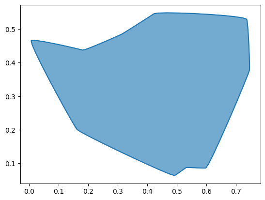
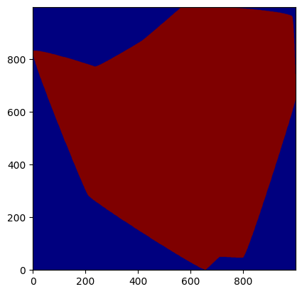

# random-shapes

Generate random shapes with ease.

> This library is heavily inspired by [this stackoverflow answer](https://stackoverflow.com/a/50751932/12031297)


## Installation

You can install random-shapes via pip:

```sh
    pip install random-shapes
```

However, `uv` is recommended for installing python packages:

```sh
    uv add random-shapes
```

## Usage

Install the optional library `matplotlib` for visualization:

```sh
    pip install random-shapes[viz]
    # or
    uv add random-shapes --extra viz
```

With random-shapes it is easy to generate a random shape (`bezier.CurvedPolygon`):

```python

    from random_shapes import Shape

    shp = Shape.random(n=10, r=0.05, edgy=0.2)
    # Shape.curve is a bezier.CurvedPolygon, since Shape is a just wrapper
    shp.curve.plot(pts_per_edge=10)
```



This shape can then be turned into a binary image:

```python
    import matplotlib.pyplot as plt

    binary_image = shp.rasterize(h=512, w=512)
    plt.imshow(binary_image, cmap="gray")
```


